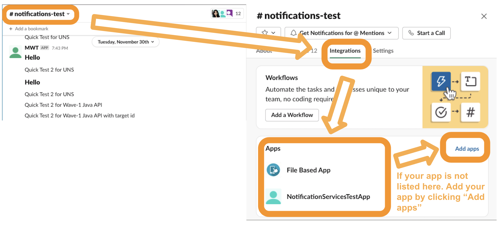

# Test-Org-Setup
### Steps of preparing a new test org for notification quick tests


1. Install SFDX CLI

https://developer.salesforce.com/docs/atlas.en-us.sfdx_setup.meta/sfdx_setup/sfdx_setup_install_cli.htm

2. Authorize your org with `sfdx auth:web:login -r {LoginURL} -a YourOrgAlias`

3. Clone this folder to your local

4. Import quick test data into the new org

    * Slack Permission

        * Do you have "Connect Salesforce with Slack" permission set enabled?

            * **YES**. Skip steps for Slack Permission

            * **NO**. 
                
                * In `testOrgSetup` folder, run 
            
                    ```
                    sfdx force:source:deploy -p force-app/main/default/permissionsets/slack_user.permissionset-meta.xml -u YourOrgAlias
                    ```

                * Assign permission to yourself with 
                
                    ```
                    sfdx force:user:permset:assign -n slack_user -u YourOrgAlias
                    ```

    * CollaborationRoom

        * Do you have CollaborationRoom records in database?

            * Check with

                ```
                sfdx force:data:soql:query -q "SELECT Id, Name, PlatformKey, TeamKey FROM CollaborationRoom" --apiversion=54.0 -u YourOrgAlias
                ```

            * **YES**. Skip steps for CollaborationRoom

            * **NO**. 
            
                * Update the values in `testOrgSetup/data/CollaborationRoom.json`. Change *PlatformKey* and *TeamKey* to the value of slack channel that you would like to receive notifications.
                
                * In `testOrgSetup` folder, run 
            
                ```
                sfdx force:data:tree:import --sobjecttreefiles data/CollaborationRoom.json --apiversion=54.0 -u YourOrgAlias 
                ```

    * NotificationUserOptOut

        * Do you have NotificationUserOptOut records in database?

            * Check with

            ```
            sfdx force:data:soql:query -q "SELECT Id, NotificationType, Record FROM NotificationUserOptOut" --apiversion=54.0 -u YourOrgAlias
            ```

            * **YES**. Skip steps for NotificationUserOptOut

            * **NO**. In `testOrgSetup` folder, run 
            
                ```
                sfdx force:data:tree:import --sobjecttreefiles data/NotificationUserOptOut.json --apiversion=54.0 -u YourOrgAlias
                ```

    * CustomNotificationTypes

        * Do you have any custom notification types with slack enabled?

            * Check with 

            ```
            sfdx force:data:soql:query -q "SELECT Id, CustomNotifTypeName FROM CustomNotificationType WHERE isslack=true" --apiversion=54.0 -u YourOrgAlias
            ```

            * **YES**. Skip steps for CustomNotificationTypes

            * **NO**. In `testOrgSetup` folder, run 
            
                ```
                sfdx force:source:deploy -p force-app/main/default/notificationtypes/testCustomNotif.notiftype-meta.xml --apiversion=54.0 -u YourOrgAlias 
                ```

    * SlackApp

        * Do you have any db-based slack app?

            * SlackApp query is not supported by sfdx yet. Go to the "Setup" of your org --> Notification Delivery Settings --> Check in "Custom Notification Types" table, is there any slack apps showing in "Slack Apps" column?

            * **YES**. Skip steps for SlackApp

            * **NO**. 
            
                * Update the values in `testOrgSetup/force-app/main/default/slackapps/A02KDL0LDBN.slackapp-meta.xml`

                * In `testOrgSetup` folder, run 
            
                    ```
                    sfdx force:source:deploy -p force-app/main/default/slackapps/A02KDL0LDBN.slackapp-meta.xml --apiversion=54.0  -u YourOrgAlias
                    ```

                * Make sure your db-based slack app has "Redirect Urls" pointing to the correct Foyer URL. If your org is on Prod or TEST1, refer [this doc](https://salesforce.quip.com/N3h3AFbIVyxy)

                * Authorize your db-based slack app with `https://yourorgdomain.force.com/slack/slack-connect?appId={appId}` 

5. Now you are ready to run quick test at `https://yourorgdomain.force.com/qa/notifications/quickTest.jsp`

### Troubleshootings:

1. After finishing all setup, if you are still not able to run Quick Test 2 for UNS (Send Slack notification via UNS to a Slack channel), please check if your Slack app has been added to that channel. 

    